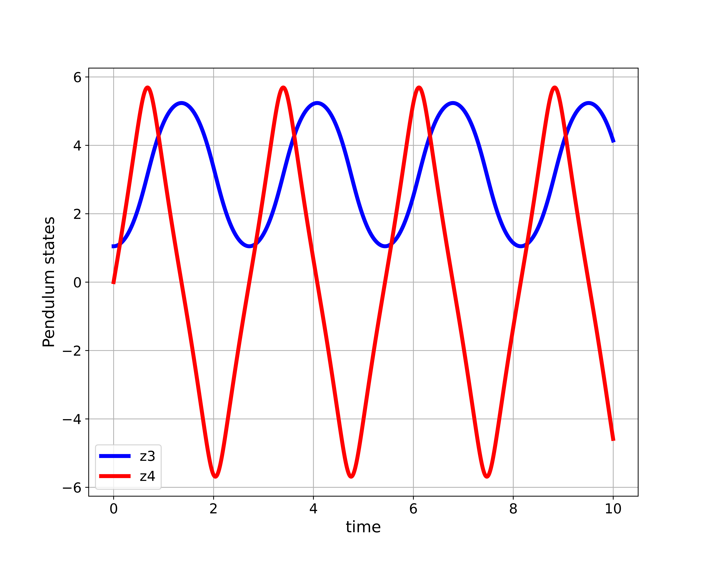

# Simulation-and-Animation-of-Cart-Pole-State-Space-Model-in-Python-and-Pygame
In this GitHub repository, we posted Python scripts that are used to

(1) Automatically derive a symbolic nonlinear state-space model of a cart-pole mechanical system. The cart-pole mechanical system is also known as an inverted pendulum on a cart system. 

(2) Simulate the derived state-space model in Python.

(3) Generate the animation of simulated state-space trajectories by using the Pygame library. 

Tutorials explaining the posted files:

- Derivation of the equations of motion of the cart-pendulum system:

  Webpage tutorial:
  https://aleksandarhaber.com/equations-of-motion-of-a-pendulum-on-a-cart-by-using-lagranges-equations/

  YouTube tutorial:
  https://www.youtube.com/watch?v=ccw7-BfDyiQ
  

- Automatic state-space modeling and simulation of the cart pendulum dynamics in Python:

   Webpage tutorial: https://aleksandarhaber.com/automatic-state-space-derivation-and-simulation-of-nonlinear-dynamical-systems-in-python-with-pendulum-on-a-cart-example/

   YouTube tutorial: https://www.youtube.com/watch?v=npwQ1B8ul2Y

- Animation of the cart-pendulum nonlinear dynamics in Python and Pygame:

  Webpage tutorial:
  https://aleksandarhaber.com/animate-dynamics-of-cart-pendulum-system-in-python-by-using-pygame-library/

  YouTube tutorial:
  https://www.youtube.com/watch?v=vpxLF4cioCo
  
  
Explanation of posted files:

